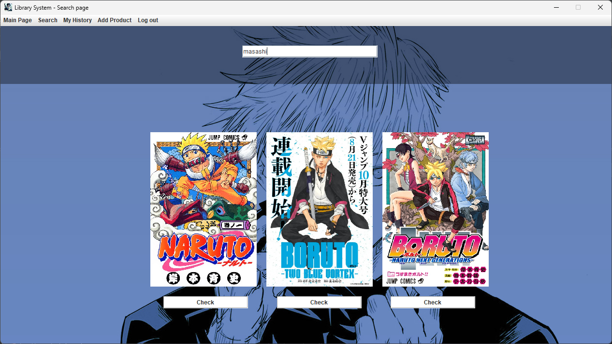

# Library System - Version 1

> A simple library system with Java Swing & Web development technologies. The project uses CRUD (Create, Read, Update, Delete) functions.

## Topics: 
* [Apperance](#Apperance)
* [Technologies in Project](#TechnologiesinProject)
* [Plans for Version 2](##PlansforVersion2)
* [Helpfull websites](#Helpfullwebsites)
* [Contact](#Contact)

# Apperance: 
### Login Page - Java Swing: 

### Main Page - Java Swing:

### Add Page - Java Swing:

### History Page - Java Swing:

### Product Page - Java Swing:

### Search Page - Java Swing:

### Sign Page - HTML:

# Technologies in Project
>Languages & Frameworks:
* PHP 8.2
* ANGULAR 18.0
* BOOTSTRAP 5.3
* CSS
* HTML
* JAVA - JSwing

> Imported Stuffs:
* PHP: [PHPMAILER](https://github.com/PHPMailer/PHPMailer)
* JAVA: [MySQL Connector](https://dev.mysql.com/downloads/connector/j/)

# Plans for Version 2
* New email system in Java
* Better design with JavaFx
* Add review and raiting for "books"
* Add filter for search
* Add JDatePicker for Product Add Page

# Helpfull websites
* [Requirements](https://www.naukri.com/code360/library/design-a-library-management-system-low-level-design)
* [Resource for every Manga/Light Novel](https://myanimelist.net)
* [PHP](https://www.php.net/)
* [Angular](https://angular.dev/overview)

# Contact
* [Facebook](https://www.facebook.com/halmai.bence.5?locale=hu_HU)
* [Linked in](https://www.linkedin.com/in/halmai-bence-5264062a4/)
* Email: sulisdolgok8@gmail.com

